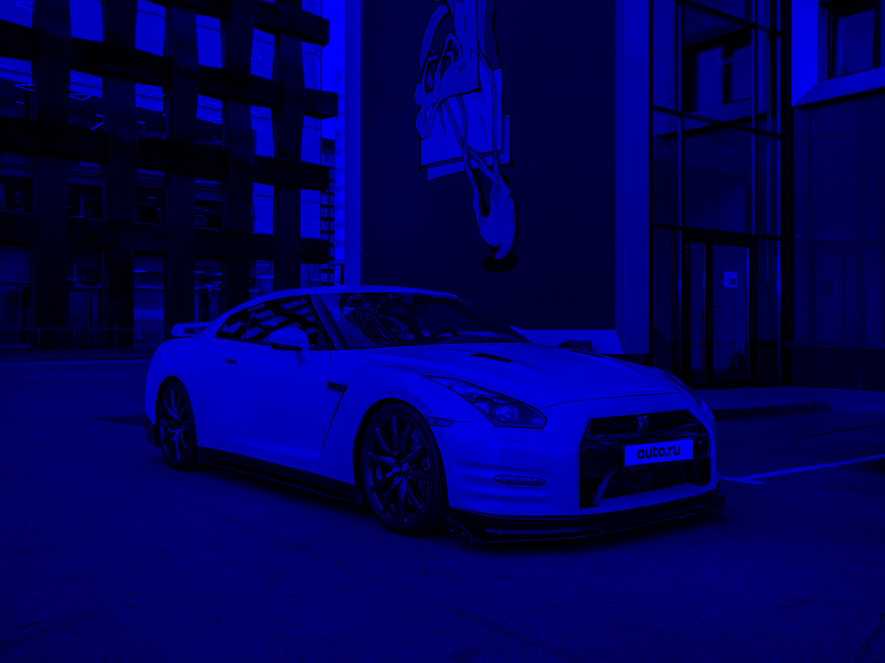
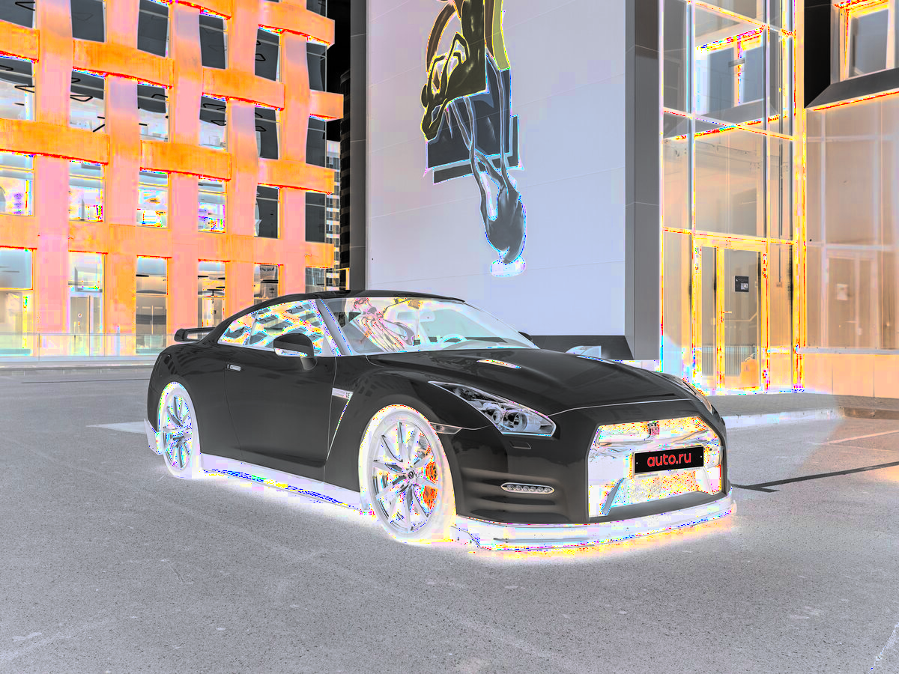

# Лабораторная работа №1
## Цветовые модели и передискретизация изображений

В работе реализованы операции с цветовыми моделями (RGB/HSI) и передискретизация изображения без использования библиотечных функций масштабирования (интерполяция и децимация реализованы вручную).

---

## Исходное изображение


---

## 1. Цветовые модели

### 1.1 Компоненты R, G, B

Компоненты сохранены как **одноканальные изображения** (карты интенсивности соответствующего канала).

| Красный канал | Зелёный канал | Синий канал |
|:------------:|:-------------:|:-----------:|
|  |  |  |

### 1.2 Яркостная компонента HSI

Преобразование RGB → HSI и сохранение яркостной компоненты **I**.


### 1.3 Инвертирование яркостной компоненты

Инверсия яркости в модели HSI: `I' = 1 - I`, затем преобразование обратно в RGB.

| Исходное изображение | С инвертированной яркостью |
|:--------------------:|:--------------------------:|
|  |  |

Демонстрация «до / после»:


---

## 2. Передискретизация (M=2, N=3, K=M/N=2/3≈0.667)

### 2.1 Растяжение в M раз (билинейная интерполяция)

| Исходное | Растянутое |
|:--------:|:----------:|
|  |  |

Демо:


### 2.2 Сжатие в N раз (децимация / прореживание)

| Исходное | Сжатое |
|:--------:|:------:|
|  |  |

Демо:


### 2.3 Двухпроходная передискретизация (растяжение + сжатие)

Сначала растяжение в `M` раз, затем децимация в `N` раз.

| Исходное | Результат двух проходов |
|:--------:|:------------------------:|
|  |  |

Демо:


### 2.4 Однопроходная передискретизация (прямое масштабирование в K раз)

Передискретизация выполняется за один проход с коэффициентом `K=M/N`.

| Исходное | Результат одного прохода |
|:--------:|:------------------------:|
|  |  |

Демо:


---

## Результаты выполнения

| Операция | Размер изображения |
|:--|--:|
| Исходное изображение | 1200×900 |
| Растяжение (M=2) | 2400×1800 |
| Сжатие (N=3) | 400×300 |
| Двухпроходная (×2, затем ÷3) | 800×600 |
| Однопроходная (K=2/3) | 800×600 |

---

## Запуск

```bash
pip install pillow numpy
python main.py --input gtr.png --out out --M 2 --N 3 --method bilinear
```

Параметры:

- M — коэффициент растяжения (целое число)

- N — коэффициент сжатия (целое число)

- method — метод интерполяции: nearest или bilinear

## Выводы

В ходе выполнения лабораторной работы сделаны:

1. Цветовые модели RGB и HSI:
   - выделение компонент R, G, B
   - преобразование RGB → HSI и выделение яркостной компоненты I
   - инвертирование яркостной компоненты и обратное преобразование в RGB

2. Методы передискретизации:
   - Реализован метод ближайшего соседа
   - Реализован метод билинейной интерполяции
   - Выполнены операции растяжения (интерполяции) и сжатия (децимации)
   - реализованы двухпроходная (растяжение + сжатие) и однопроходная передискретизация в K=M/N раз
