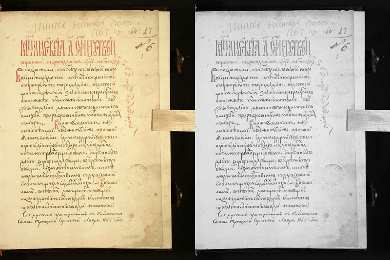
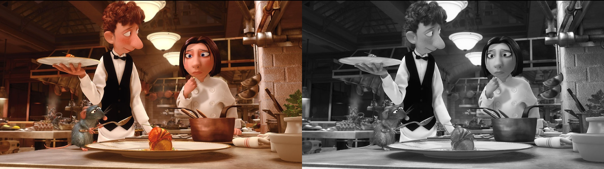
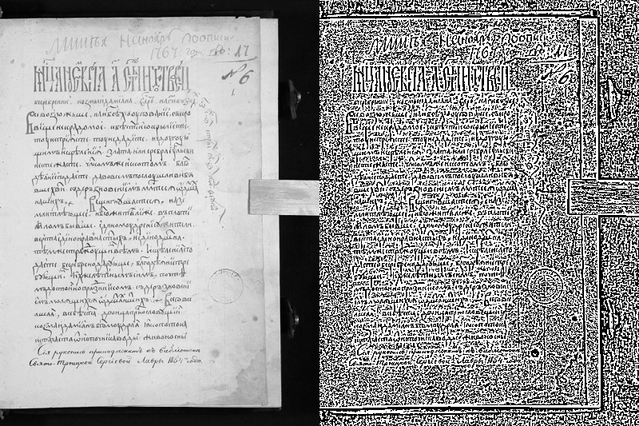
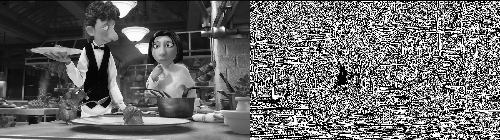

# Лабораторная работа №2: Обесцвечивание и бинаризация (вариант 14 - Адаптивное монохромное преобразование с усреднением по окну, окно 5x5)

## Реализовано
1. Приведение полноцветного RGB-изображения к полутоновому:
    - Формула: `Y = 0.3 * R + 0.59 * G + 0.11 * B`
    - Результат сохраняется как `BMP` в режиме `L` (1 яркостный канал).

2. Приведение полутонового изображения к монохромному:
    - Метод: адаптивная пороговая обработка с усреднением по окну `5x5`.
    - Для каждого пикселя берётся средняя яркость в окне `5x5`.
    - Если `pixel > local_mean`, то `255`, иначе `0`.
    - Результат сохраняется как `BMP` (1-битное монохромное изображение).

Библиотечные функции приведения к полутону и бинаризации не используются.

## Структура
- `main.py` — код
- `input_images/` — исходные изображения (`.bmp`, `.png`)
- `output/grayscale/` — полутоновые изображения
- `output/binary/` — бинарные изображения
- `output/comparisons/` — визуализации до/после

## Запуск
1. Поместите входные изображения (`bmp` или `png`) в `input_images/`.
2. Выполните:

```bash
python main.py
```

Или можно указать свои папки:

```bash
python main.py --input-dir ./input_images --output-dir ./output
```

## Демонстрация выполнения заданий (до/после)

### 1. Приведение полноцветного изображения к полутоновому
До/после (слева исходное RGB, справа результат в полутоне):

Пример 1 (текст):


Пример 2 (кадр из мультфильма):


### 2. Приведение полутонового изображения к монохромному (адаптивный порог, окно 5x5)
До/после (слева полутоновое, справа бинарное):

Пример 1 (текст):


Пример 2 (кадр из мультфильма):


Дополнительно сохранённые результаты:
- Полутоновое изображение: `output/grayscale/image-0.2-2.jpeg_gray.bmp`
- Бинарное изображение: `output/binary/image-0.2-2.jpeg_binary.bmp`
- Полутоновое изображение: `output/grayscale/ratatouille_gray.bmp`
- Бинарное изображение: `output/binary/ratatouille_binary.bmp`
