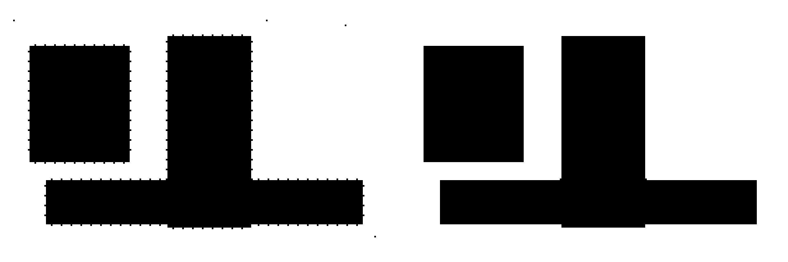
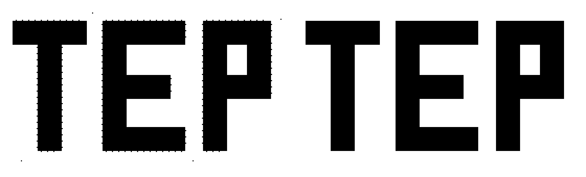
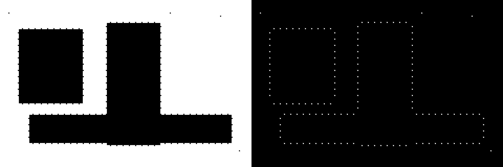
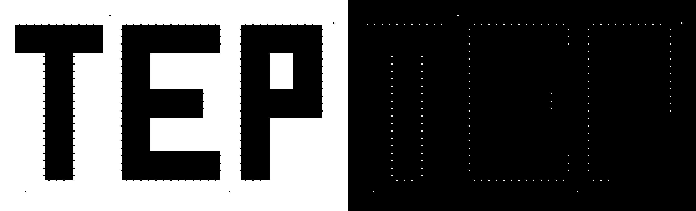

# Лабораторная работа №3: Фильтрация изображений и морфологические операции

## Вариант 13
- Метод: фильтр `стирание бахромы`
- Окно: `3x3`
- Цвет бахромы: `черная`

## Что делает программа
Для каждого бинарного изображения программа
1. загружает изображение в монохромном виде
2. применяет фильтр стирания черной бахромы
3. сохраняет отфильтрованное изображение
4. строит разностное изображение `XOR`

Во входной папке лежат специально подготовленные бинарные примеры для этой лабораторной:
- `figures_black_fringe.png` — толстые геометрические фигуры с частой черной бахромой по границе и одиночными шумовыми пикселями
- `symbols_black_fringe.png` — толстые символы с черной бахромой по внешнему контуру

## Как реализован фильтр
удаляются:
- изолированный пиксель
- крайние пиксели

Для верхнего крайнего пикселя используются 6 апертур `3x3`:

```text
0 0 0   0 0 0   0 0 0   0 0 0   0 0 0   0 0 0
0 1 0   0 1 0   0 1 0   0 1 0   0 1 0   0 1 0
1 0 0   0 1 0   0 0 1   1 1 0   0 1 1   1 1 1
```

Остальные направления получаются поворотом апертур на `90`, `180` и `270` градусов.

Так как в задании нужна именно черная бахрома, в коде используются инвертированные апертуры из лекции

## Структура
- `main.py` — код
- `input_images/` — входные бинарные изображения
- `output/filtered/` — отфильтрованные изображения
- `output/difference/` — разностные изображения `XOR`
- `output/comparisons/` — картинки `до/после`

## Запуск
```bash
python main.py
```

Или с явным указанием путей:

```bash
python main.py --input-dir ./input_images --output-dir ./output
```

## Демонстрация работы
Для наглядности изображения в `output/comparisons/` сохранены увеличенными без сглаживания

### 1. Отфильтрованное изображение
Слева исходное бинарное изображение, справа результат после фильтрации

Пример 1 (геометрические фигуры):


Пример 2 (символы):


### 2. Разностное изображение XOR
Слева исходное бинарное изображение, справа `XOR`, показывающий удаленные пиксели бахромы

Пример 1 (геометрические фигуры):


Пример 2 (символы):


## Примечание
Фильтр рассчитан на бинарные изображения. Поэтому в `input_images/` используются не полутоновые и не цветные картинки, а уже готовые черно-белые примеры
