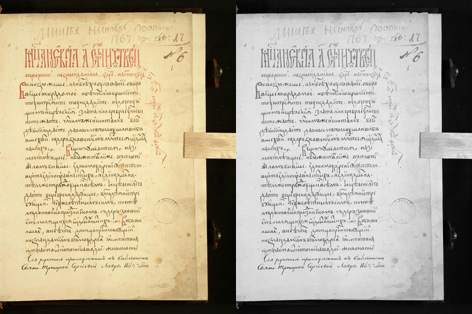
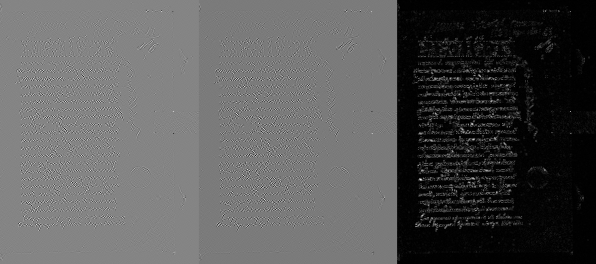
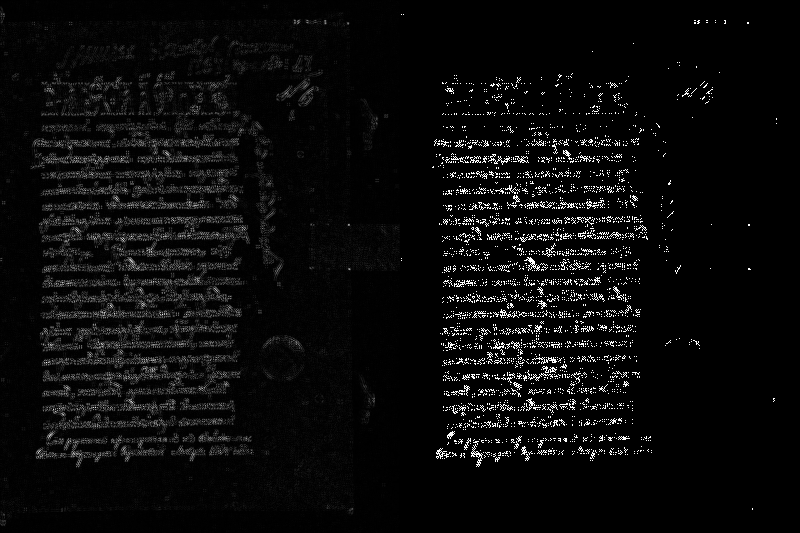
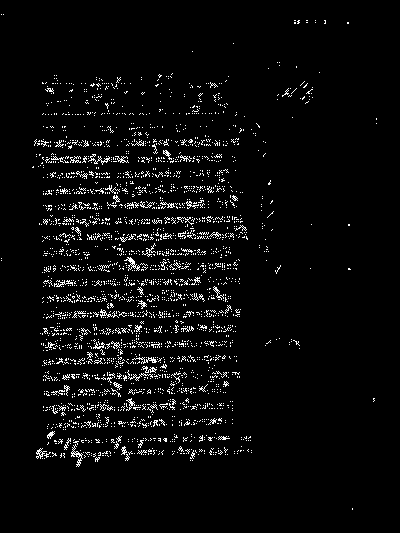
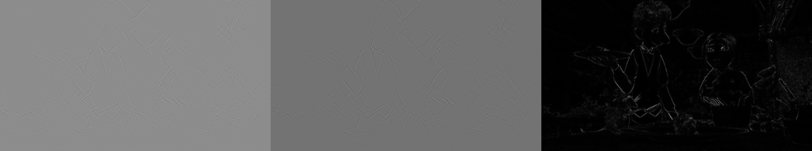
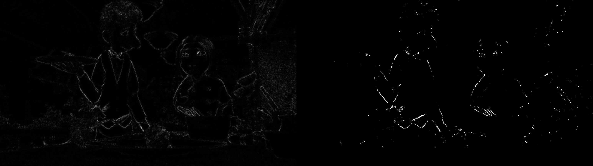
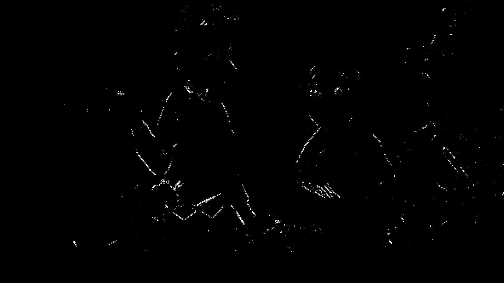

# Лабораторная работа №4: Выделение контуров на изображении

## Вариант 13:
- Метод: градиентное выделение контуров
- Оператор: `Кайяли 3x3`
- Формула градиента: `G = sqrt(Gx^2 + Gy^2)`

## Что делает программа
Для каждого входного изображения программа:
1. загружает исходное изображение;
2. если изображение цветное, переводит его в полутоновое по формуле `Y = 0.3 * R + 0.59 * G + 0.11 * B`;
3. вычисляет градиенты `Gx` и `Gy` оператором Кайяли;
4. вычисляет градиентную матрицу `G`;
5. нормализует `Gx`, `Gy`, `G` в диапазон `0..255`;
6. бинаризует `G` по порогу `T`.

Библиотечные функции выделения контуров не используются.

## Ядра оператора Кайяли
```text
Gx =  [ +6   0  -6 ]     Gy =  [ -6   0  +6 ]
      [  0   0   0 ]           [  0   0   0 ]
      [ -6   0  +6 ]           [ +6   0  -6 ]
```

## Нормализация по лекции
- `Gx` и `Gy` нормализуются по минимуму и максимуму в диапазон `0..255`
- `G` нормализуется по максимальному значению в диапазон `0..255`
- бинаризация выполняется по правилу `255 * [G > T]`

Для приложенных примеров по умолчанию выбран порог `T = 64`. При необходимости его можно поменять через аргумент командной строки.

## Структура
- `main.py` — код
- `input_images/` — входные изображения
- `output/grayscale/` — полутоновые изображения
- `output/gx/` — нормализованные матрицы `Gx`
- `output/gy/` — нормализованные матрицы `Gy`
- `output/g/` — нормализованные матрицы `G`
- `output/binary/` — бинаризованные матрицы `G`
- `output/comparisons/` — визуализации результатов

## Запуск
```bash
python main.py
```

С явным указанием параметров:

```bash
python main.py --input-dir ./input_images --output-dir ./output --threshold 64
```

## Что демонстрируется
Для каждого изображения сохраняются:
1. исходное цветное изображение: левая часть `output/comparisons/*_original_to_gray.png`
2. полутоновое изображение: правая часть `output/comparisons/*_original_to_gray.png`
3. три нормализованные градиентные матрицы `Gx`, `Gy`, `G`: `output/comparisons/*_gx_gy_g.png`
4. бинаризованная градиентная матрица `G`: `output/binary/*.bmp` и `output/comparisons/*_binary_only.png`

Дополнительно сохраняются:
- сравнение `G` и бинаризации: `output/comparisons/*_g_to_binary.png`
- общая сводка из шести изображений: `output/comparisons/*_summary.png`

## Примеры результатов
### 1. Текстовое изображение
Исходное и полутоновое:



Градиенты `Gx`, `Gy`, `G`:



`G` и бинаризация:



Бинаризованная матрица `G`:



### 2. Цветное изображение
Исходное и полутоновое:


Градиенты `Gx`, `Gy`, `G`:



`G` и бинаризация:



Бинаризованная матрица `G`:


