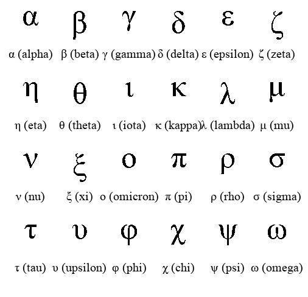

# Лабораторная работа №5: Выделение признаков символов

## Вариант 13
- Алфавит: `греческие строчные буквы`
- Шрифт: `Times New Roman`
- Размер: `52`

Используется набор:

```text
αβγδεζηθικλμνξοπρστυφχψω
```

## Что делает программа
1. генерирует эталонные изображения символов
2. обрезает белые поля вокруг каждого символа
3. сохраняет изображения по принципу `1 символ = 1 файл`
4. считает скалярные признаки
5. строит профили `X` и `Y`
6. сохраняет скалярные признаки в `CSV` с разделителем `;`, а профили в `PNG`

## Какие признаки считаются
Для каждого символа вычисляются:
- вес черного в 4 четвертях изображения:
  `q1` — верхняя левая, `q2` — верхняя правая, `q3` — нижняя левая, `q4` — нижняя правая
- удельный вес каждой четверти:
  вес четверти, деленный на площадь четверти
- координаты центра тяжести
- нормированные координаты центра тяжести
- осевые моменты инерции по горизонтали и вертикали
- нормированные осевые моменты инерции
- профили `X` и `Y`

В коде черный пиксель считается как `1`, белый как `0`, поэтому все моменты и веса считаются по множеству черных точек символа

## Нормировки
- `x_norm = x / (M - 1)`
- `y_norm = y / (N - 1)`
- `I_x_norm = I_x / (M^2 * N^2)`
- `I_y_norm = I_y / (M^2 * N^2)`

где `M` — ширина изображения, `N` — высота изображения

## Профили
- профиль `X`:
  сумма черных пикселей в каждом столбце
- профиль `Y`:
  сумма черных пикселей в каждой строке

Для правильной ориентации:
- `X` сохраняется как обычная вертикальная столбчатая диаграмма
- `Y` сохраняется как горизонтальная столбчатая диаграмма, где `y = 0` находится сверху, как в изображении

Подписи на осях строятся целыми числами

## Структура
- `main.py` — код лабораторной
- `output/symbols/` — эталонные изображения символов
- `output/profiles/x/` — профили `X`
- `output/profiles/y/` — профили `Y`
- `output/features.csv` — таблица со скалярными признаками
- `output/symbols_gallery.png` — общая галерея всех эталонов

## Запуск
```bash
python main.py
```

С явным указанием параметров:

```bash
python main.py --output-dir ./output --font-path "/System/Library/Fonts/Supplemental/Times New Roman.ttf" --font-size 52
```

## Что сохраняется
1. Эталонные изображения символов:
   `output/symbols/*.png`
2. Профили `X`:
   `output/profiles/x/*_profile_x.png`
3. Профили `Y`:
   `output/profiles/y/*_profile_y.png`
4. Таблица признаков:
   `output/features.csv`

## Примеры результатов
### 1. Все сгенерированные эталоны


### 2. Пример отдельного символа


### 3. Пример профиля X


### 4. Пример профиля Y


## Формат CSV
Файл `output/features.csv` использует разделитель `;`

В таблице есть:
- имя файла
- имя символа
- сам символ
- шрифт и размер
- размеры изображения
- веса четвертей
- удельные веса четвертей
- координаты центра тяжести
- нормированные координаты центра тяжести
- осевые моменты инерции
- нормированные осевые моменты инерции
