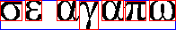
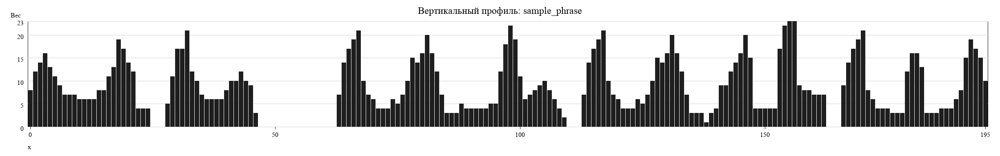
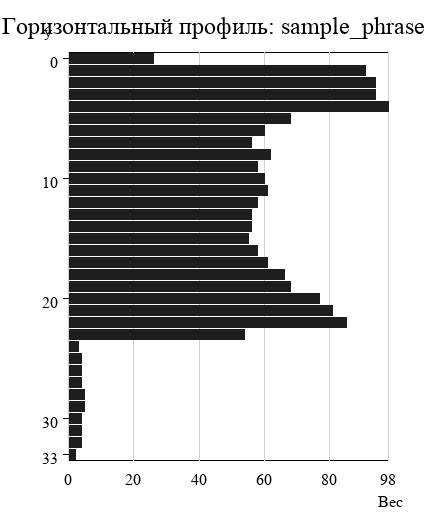
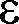
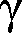
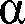
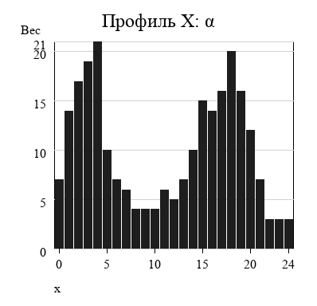
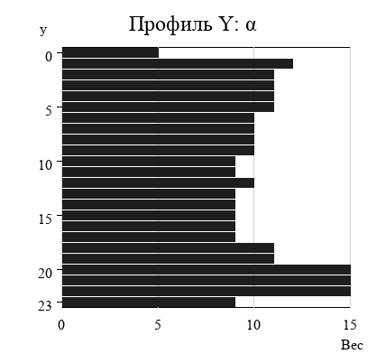

# Лабораторная работа №6: Сегментация текста

## Вариант (из лабы №5)
- Алфавит: `греческие строчные буквы`
- Шрифт: `Times New Roman`
- Размер: `52`
- Фраза для примера: `σε αγαπω`

Используется набор символов:

```text
αβγδεζηθικλμνξοπρστυφχψω
```

## Что сделано
1. рассчитываются горизонтальный и вертикальный профили изображения
2. текстовая область находится по профилям
3. строки выделяются по горизонтальному профилю
4. символы в строке выделяются по вертикальному профилю
5. ложные границы удаляются, если ширина сегмента меньше `5` пикселей
6. сохраняются прямоугольники символов, вырезанные символы и профили
7. отдельно строятся профили символов выбранного алфавита

Алгоритм сегментации сделан по лекционному методу профилей:
- начало границы: переход от нулевых или малых значений к большим;
- конец границы: переход от больших значений к нулевым или малым;
- для символов используется дополнительное удаление слишком узких ложных сегментов.

## Структура
- `main.py` — код лабораторной
- `input_images/` — входные изображения строки
- `output/binary/` — бинарные изображения
- `output/profiles/text/` — профили входной строки
- `output/segmentation/` — изображение с прямоугольниками
- `output/segmented_symbols/` — вырезанные символы
- `output/tables/` — координаты прямоугольников символов
- `output/alphabet_profiles/` — профили символов алфавита

## Запуск
Из директории `lab6`:

```bash
python main.py
```

С явным указанием параметров:

```bash
python main.py --input-dir ./input_images --output-dir ./output --binary-threshold 128 --profile-threshold 1 --min-symbol-width 5
```

## Что сохраняется
Для каждой входной строки:
1. бинарное изображение: `output/binary/*.bmp`
2. вертикальный профиль: `output/profiles/text/*_profile_x.png`
3. горизонтальный профиль: `output/profiles/text/*_profile_y.png`
4. прямоугольники вокруг символов: `output/segmentation/*_boxes.png`
5. вырезанные символы: `output/segmented_symbols/<имя_файла>/`
6. таблица координат: `output/tables/*_rectangles.csv`

Дополнительно:
1. изображения символов алфавита: `output/alphabet_profiles/symbols/`
2. профили `X` символов: `output/alphabet_profiles/profiles/x/`
3. профили `Y` символов: `output/alphabet_profiles/profiles/y/`

## Примеры результатов
### 1. Сегментация строки
Прямоугольники вокруг найденных символов:



### 2. Вертикальный профиль строки


### 3. Горизонтальный профиль строки


### 4. Вырезанные символы строки
Символ 1:


Символ 2:



Символ 3:


Символ 4:



Символ 5:



Символ 6:


Символ 7:


### 5. Пример профилей символа алфавита
Символ `α`:


Профиль `X` для `α`:



Профиль `Y` для `α`:



## Примечание
Если в `input_images/` нет файлов, программа автоматически создает простой пример `sample_phrase.bmp` с фразой `σε αγαπω`, чтобы лабораторная сразу запускалась.
