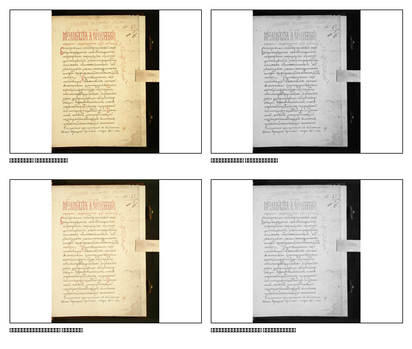
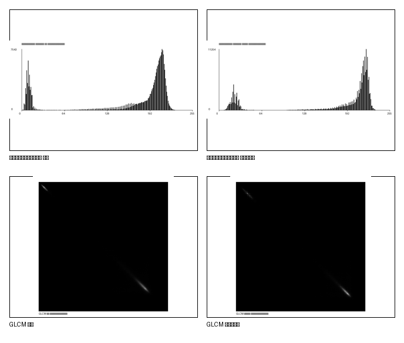
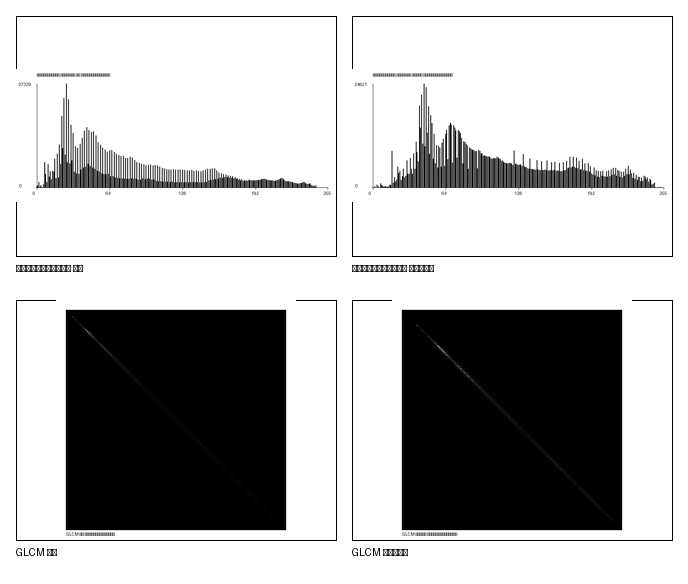

# Лабораторная работа №8: Текстурный анализ и контрастирование

## Вариант 13:
- матрица: `GLCM`
- параметры: `d = 1`, `phi = {0, 90, 180, 270}`
- признак: `CORR`
- метод преобразования яркости: `степенное`

## Что сделано
1. Для каждого входного изображения строится матрица пространственной смежности `GLCM`.
2. Для матрицы считается нормализованный вариант и по нему вычисляется признак `CORR`.
3. Для цветных изображений используется модель `HSL`: преобразование применяется только к каналу яркости `L`, каналы `H` и `S` не меняются.
4. Для полутоновых изображений преобразование выполняется прямо по яркости.
5. Строятся гистограммы яркости до и после контрастирования.
6. Сохраняются визуализации матриц `GLCM`, полутоновые и контрастированные изображения.

## Формулы из лекции
Матрица `GLCM`:

```text
n(i, j) — число соседств пикселей с яркостями i и j
```

Нормализованная матрица:

```text
p(i, j) = n(i, j) / K
K = sum(sum(n(i, j)))
```

Профили по строкам и столбцам:

```text
Pi = sum_j p(i, j)
Pj = sum_i p(i, j)
```

Средние и СКО:

```text
mu_r = sum_i i * Pi
mu_c = sum_j j * Pj
sigma_r = sqrt(sum_i (i - mu_r)^2 * Pi)
sigma_c = sqrt(sum_j (j - mu_c)^2 * Pj)
```

Корреляция:

```text
CORR = sum_i sum_j ((i - mu_r) * (j - mu_c) * p(i, j)) / (sigma_r * sigma_c)
```

Степенное преобразование яркости из лекции по контрастированию:

```text
g(n, m) = c * (f(n, m) + f0)^gamma
```

Перед преобразованием яркость нормируется в диапазон `[0, 1]`, после преобразования снова переводится в `[0, 255]`.

В работе использовано:

```text
c = 1
f0 = 0
gamma = 0.75
```

## Входные изображения
В `input_images/` подготовлены 3 изображения разного типа:
- `image-0.2-2.jpeg.png`
- `ratatouille.png`
- `sample_phrase_52.bmp`

## Структура
- `main.py` — основной код лабораторной
- `input_images/` — входные изображения
- `output/grayscale/` — полутоновые изображения
- `output/contrasted_grayscale/` — контрастированные полутоновые изображения
- `output/contrasted_color/` — контрастированные цветные изображения
- `output/histograms/` — гистограммы яркости
- `output/matrices/` — матрицы `GLCM` в `CSV` и их визуализации
- `output/comparisons/` — итоговые коллажи
- `output/results.csv` — таблица результатов
- `output/reports/report.txt` — краткий текстовый отчет

## Запуск
Из директории `lab8`:

```bash
python main.py
```

С явным указанием параметров:

```bash
python main.py --input-dir ./input_images --output-dir ./output --gamma 0.75
```

## Особенности визуализации
- Для матриц `GLCM` используется визуализация в оттенках серого.
- Так как матрицы `256 x 256` получаются разреженными и в обычной шкале выглядят почти черными, для картинки применяется логарифмическое нормирование.

## Результаты
### Значения `CORR`
- `image-0.2-2.jpeg.png`: `0.960013 -> 0.969052`
- `ratatouille.png`: `0.991483 -> 0.991579`
- `sample_phrase_52.bmp`: `0.748072 -> 0.748072`

### Краткое сравнение
- Для `image-0.2-2.jpeg.png` после степенного преобразования корреляция выросла заметнее всего.
- Для `ratatouille.png` признак `CORR` почти не изменился, хотя средняя яркость стала выше.
- Для бинарного текстового изображения `sample_phrase_52.bmp` признак не изменился, потому что значения яркости уже были крайними: `0` и `255`.

## Примеры итоговых файлов
### 1. Сравнение изображений


### 2. Гистограммы и матрицы


### 3. Еще один пример

